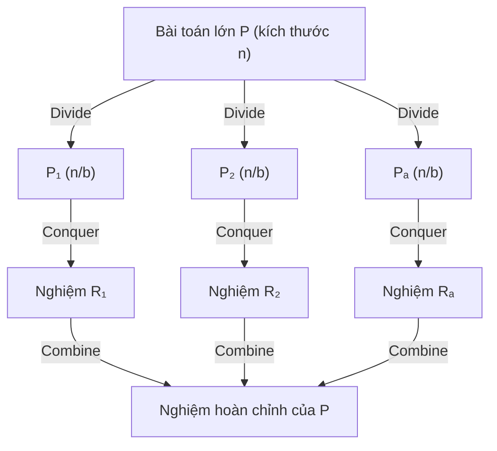
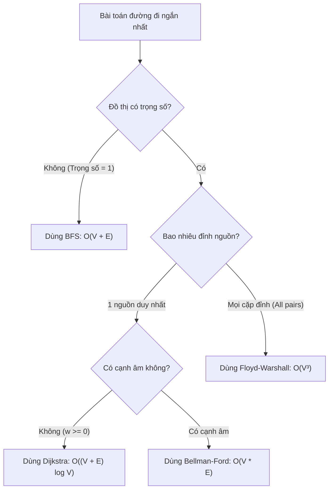
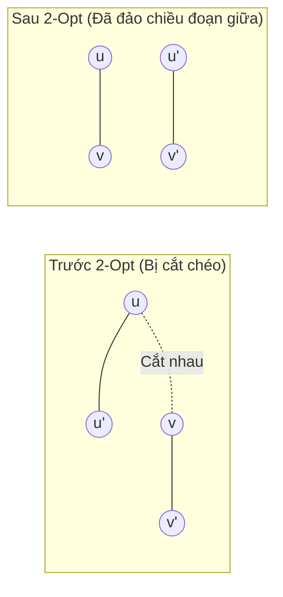

# 📚 CẨM NANG TINH TUÝ THIẾT KẾ VÀ PHÂN TÍCH THUẬT TOÁN (TTUD)
> **Tài liệu tổng hợp & đúc kết toàn diện từ 9 chuyên đề bài giảng môn Thuật toán ứng dụng / Thiết kế & Đánh giá Thuật toán**  
> *Biên soạn phục vụ ôn tập, tra cứu nhanh, nắm bắt bản chất giải thuật và áp dụng thực tế.*

---

## 📑 MỤC LỤC TỔNG QUAN

1. [Chuyên đề 1: Phân tích Độ phức tạp Thuật toán & Ký hiệu Tiệm cận](#1-phân-tích-độ-phức-tạp-thuật-toán--ký-hiệu-tiệm-cận)
2. [Chuyên đề 2: Chiến lược Chia để trị (Divide and Conquer)](#2-chiến-lược-chia-để-trị-divide-and-conquer)
3. [Chuyên đề 3: Chiến lược Thuật toán Tham lam (Greedy Algorithms)](#3-chiến-lược-thuật-toán-tham-lam-greedy-algorithms)
4. [Chuyên đề 4: Quy hoạch động (Dynamic Programming)](#4-quy-hoạch-động-dynamic-programming)
5. [Chuyên đề 5: Đồ thị & Các Thuật toán Duyệt Cơ bản (BFS / DFS)](#5-đồ-thị--các-thuật-toán-duyệt-cơ-bản-bfs--dfs)
6. [Chuyên đề 6: Thuật toán Đường đi Ngắn nhất (Shortest Paths)](#6-thuật-toán-đường-đi-ngắn-nhất-shortest-paths)
7. [Chuyên đề 7: Cây khung Nhỏ nhất (MST) & Cấu trúc Disjoint Set Union (DSU)](#7-cây-khung-nhỏ-nhất-mst--cấu-trúc-disjoint-set-union-dsu)
8. [Chuyên đề 8: Mạng Luồng & Luồng Cực đại (Network Flow & Max-Flow Min-Cut)](#8-mạng-luồng--luồng-cực-đại-network-flow--max-flow-min-cut)
9. [Chuyên đề 9: Bài toán Khó, Tối ưu Tổ hợp (Euler, Hamilton, TSP, VRP & Heuristic)](#9-bài-toán-khó-tối-ưu-tổ-hợp-euler-hamilton-tsp-vrp--heuristic)
10. [Bảng Tra Cứu Tổng Hợp & Bẫy Cài Đặt (Cheat Sheet & Pitfalls)](#10-bảng-tra-cứu-tổng-hợp--bẫy-cài-đặt)

---

# 1. PHÂN TÍCH ĐỘ PHỨC TẠP THUẬT TOÁN & KÝ HIỆU TIỆM CẬN

### 1.1. Bản chất và Ký hiệu Tiệm cận (Asymptotic Notations)
Độ phức tạp thuật toán đo lường tốc độ tăng về **thời gian thực thi (Time Complexity)** và **bộ nhớ sử dụng (Space Complexity)** theo kích thước đầu vào $n$.

| Ký hiệu | Tên gọi | Ý nghĩa toán học | Bản chất |
| :--- | :--- | :--- | :--- |
| $O(g(n))$ | **Big-O** (Cận trên) | $\exists c > 0, n_0 > 0 : 0 \le f(n) \le c \cdot g(n), \forall n \ge n_0$ | Thuật toán chạy **không chậm hơn** $g(n)$ (Trường hợp xấu nhất). |
| $\Omega(g(n))$ | **Big-Omega** (Cận dưới) | $\exists c > 0, n_0 > 0 : 0 \le c \cdot g(n) \le f(n), \forall n \ge n_0$ | Thuật toán chạy **ít nhất** tốn $g(n)$ thao tác (Trường hợp tốt nhất). |
| $\Theta(g(n))$ | **Big-Theta** (Cận chặt) | $\exists c_1, c_2 > 0, n_0 > 0 : c_1 g(n) \le f(n) \le c_2 g(n), \forall n \ge n_0$ | Đánh giá chính xác tiệm cận (khi cận trên trùng cận dưới). |

```
Tốc độ tăng:  O(1) < O(log n) < O(n) < O(n log n) < O(n²) < O(n³) < O(2ⁿ) < O(n!)
```

> [!TIP]
> **Quy tắc ước lượng thực tế**: Máy tính tiêu chuẩn thực thi khoảng **$10^8$ phép tính / giây**.
> - $n \le 10 \implies O(n!)$
> - $n \le 20 \implies O(2^n)$
> - $n \le 500 \implies O(n^3)$
> - $n \le 5000 \implies O(n^2)$
> - $n \le 10^5 - 10^6 \implies O(n \log n)$ hoặc $O(n)$
> - $n > 10^8 \implies O(\log n)$ hoặc $O(1)$

---

### 1.2. Định lý Thợ (Master Theorem)
Áp dụng giải nhanh phương trình truy hồi dạng chia để trị:  
$$T(n) = a \cdot T\left(\frac{n}{b}\right) + f(n) \quad (a \ge 1, b > 1)$$

So sánh hàm chi phí kết hợp $f(n)$ với $n^{\log_b a}$:

| Trường hợp | Điều kiện | Kết luận $T(n)$ | Ví dụ tiêu biểu |
| :--- | :--- | :--- | :--- |
| **TH 1** (Cây áp đảo) | $f(n) = O(n^{\log_b a - \epsilon})$ với $\epsilon > 0$ | $T(n) = \Theta(n^{\log_b a})$ | $T(n) = 4T(n/2) + n \implies \Theta(n^2)$ |
| **TH 2** (Cân bằng) | $f(n) = \Theta(n^{\log_b a} \cdot \log^k n)$ với $k \ge 0$ | $T(n) = \Theta(n^{\log_b a} \cdot \log^{k+1} n)$ | Merge Sort: $2T(n/2) + \Theta(n) \implies \Theta(n \log n)$ |
| **TH 3** (Gốc áp đảo) | $f(n) = \Omega(n^{\log_b a + \epsilon})$ & thỏa $a f(n/b) \le c f(n)$ ($c < 1$) | $T(n) = \Theta(f(n))$ | $T(n) = 2T(n/2) + n^2 \implies \Theta(n^2)$ |

> [!WARNING]
> **Không áp dụng được Định lý Thợ khi**:
> 1. $a$ hoặc $b$ không phải là hằng số (vd: $T(n) = T(\sqrt{n}) + n$).
> 2. $f(n)$ không phải dạng đa thức (vd: $f(n) = 2^n$).
> 3. Khoảng cách giữa $f(n)$ và $n^{\log_b a}$ không đạt bậc đa thức (đa thức bị kẹp bởi $\log$, vd $f(n) = n^{\log_b a} / \log n$).

---

# 2. CHIẾN LƯỢC CHIA ĐỂ TRỊ (DIVIDE AND CONQUER)

### 2.1. Khung 3 bước chuẩn
1. **Divide (Chia)**: Chia bài toán kích thước $n$ thành $a$ bài toán con cùng loại có kích thước $n/b$.
2. **Conquer (Trị)**: Giải đệ quy các bài toán con. Nếu kích thước đủ nhỏ (Base case), giải trực tiếp.
3. **Combine (Kết hợp)**: Gộp kết quả các bài toán con thành nghiệm của bài toán ban đầu (tốn chi phí $f(n)$).



---

### 2.2. Các thuật toán kinh điển & Phân tích

| Thuật toán | Bước Divide | Bước Conquer | Bước Combine | Độ phức tạp (Best/Avg/Worst) | Bộ nhớ | Tính ổn định |
| :--- | :--- | :--- | :--- | :--- | :--- | :--- |
| **Binary Search** | So sánh phần tử giữa $O(1)$ | Đệ quy trên 1 nửa | Không cần | $O(1) / O(\log n) / O(\log n)$ | $O(1)$ | — |
| **Merge Sort** | Chia đôi mảng $O(1)$ | Đệ quy 2 nửa | Trộn hai mảng đã sắp xếp $\Theta(n)$ | $\Theta(n \log n)$ mọi trường hợp | $O(n)$ | **Có (Stable)** |
| **Quick Sort** | Phân hoạch quanh pivot $\Theta(n)$ | Đệ quy 2 phía của pivot | Đã nằm đúng chỗ, không tốn chi phí | $O(n \log n) / O(n \log n) / \Theta(n^2)$ | $O(\log n)$ stack | **Không** |

#### Tinh tuý Quick Sort & Ngẫu nhiên hoá (Randomized Quick Sort):
- **Trường hợp xấu nhất $\Theta(n^2)$** xảy ra khi chọn pivot luôn rơi vào phần tử nhỏ nhất/lớn nhất (mảng đã có thứ tự sẵn).
- **Giải pháp**: Chọn pivot ngẫu nhiên (`random index` đổi chỗ với phần tử cuối). Khi đó kỳ vọng thời gian chạy là $E[T(n)] = O(n \log n)$ với mọi bộ dữ liệu.
- **Tại sao Quick Sort thực tế nhanh hơn Merge Sort?** Hằng số ẩn nhỏ, sắp xếp tại chỗ (in-place), thân thiện tối ưu bộ nhớ đệm (cache-friendly).

---

# 3. CHIẾN LƯỢC THUẬT TOÁN THAM LAM (GREEDY ALGORITHMS)

### 3.1. Bản chất & Hai điều kiện cốt lõi
Thuật toán tham lam đưa ra quyết định tối ưu **cục bộ** tại mỗi bước với hy vọng đạt được nghiệm tối ưu **toàn cục**, không bao giờ quay lại thay đổi quyết định đã qua.

1. **Tính chất lựa chọn tham lam (Greedy Choice Property)**: Lựa chọn tối ưu toàn cục có thể đạt được bằng cách thực hiện các lựa chọn tối ưu cục bộ.
2. **Cấu trúc con tối ưu (Optimal Substructure)**: Nghiệm tối ưu của bài toán chứa nghiệm tối ưu của các bài toán con.

```
Kỹ thuật chứng minh: "ĐỔI CHỖ" (Exchange Argument)
Giả sử nghiệm tối ưu OPT khác nghiệm tham lam G. 
Từng bước hoán đổi các phần tử của OPT sang G mà không làm giảm giá trị mục tiêu => G cũng tối ưu.
```

---

### 3.2. 4 Bài toán kinh điển

```
1. Lập lịch khoảng (Activity Selection):
   - Tiêu chí tham lam: Chọn công việc có THỜI GIAN KẾT THÚC (finish time) SỚM NHẤT.
   - Độ phức tạp: O(n log n) (sắp xếp theo fᵢ).

2. Đổi tiền xu (Coin Change):
   - Tiêu chí tham lam: Chọn đồng xu có mệnh giá lớn nhất có thể.
   - Cảnh báo: Chỉ đúng với hệ tiền tệ chính quy (canonical: 1, 2, 5, 10, 20...). 
   - Với hệ tổng quát (vd: {1, 3, 4} đổi 6): Tham lam ra 4+1+1 (3 đồng), tối ưu là 3+3 (2 đồng) => PHẢI DÙNG QUY HOẠCH ĐỘNG.

3. Ba lô phân số (Fractional Knapsack):
   - Tiêu chí tham lam: Chọn vật có TỶ LỆ GIÁ TRỊ / KHỐI LƯỢNG (vᵢ/wᵢ) CAO NHẤT.
   - Độ phức tạp: O(n log n). Được phép cắt nhỏ vật.
   - Lưu ý: Ba lô 0-1 nguyên vẹn KHÔNG áp dụng tham lam được.

4. Mã hoá Huffman (Huffman Coding):
   - Cây mã tiền tố tối ưu (Prefix code).
   - Cơ chế: Dùng Min-Heap, mỗi bước lấy 2 nút có tần số nhỏ nhất gộp thành 1 cây con => O(n log n).
```

---

# 4. QUY HOẠCH ĐỘNG (DYNAMIC PROGRAMMING)

### 4.1. Điều kiện áp dụng & Hai phong cách cài đặt
Quy hoạch động áp dụng khi bài toán thỏa mãn 2 tính chất:
1. **Cấu trúc con tối ưu (Optimal Substructure)**.
2. **Bài toán con gối nhau / Chồng lấp (Overlapping Subproblems)**: Cùng một bài toán con được tính đi tính lại nhiều lần.

| Đặc điểm | Top-Down (Memoization - Đệ quy có nhớ) | Bottom-Up (Tabulation - Điền bảng lặp) |
| :--- | :--- | :--- |
| **Cơ chế** | Bắt đầu từ bài toán lớn $\to$ gọi đệ quy $\to$ lưu kết quả vào mảng/bảng băm. | Bắt đầu từ bài toán cơ sở (base cases) $\to$ tính dần lên bài toán lớn qua vòng lặp. |
| **Ưu điểm** | Dễ tư duy tự nhiên, chỉ tính trạng thái thực sự cần thiết. | Không lo tràn ngăn xếp (stack overflow), dễ tối ưu bộ nhớ $O(1)$ hoặc $O(W)$. |
| **Nhược điểm**| Tốn chi phí gọi hàm và bộ nhớ stack $O(\text{độ sâu đệ quy})$. | Có thể phải tính cả những trạng thái không bao giờ được dùng đến. |

---

### 4.2. Các bài toán DP mẫu mực

#### 1. Đổi tiền (Coin Change - Số đồng xu ít nhất)
- **Trạng thái**: $dp[x]$ là số đồng xu ít nhất để đổi số tiền $x$.
- **Truy hồi**: $dp[x] = \min_{d_i \le x} \{dp[x - d_i]\} + 1$. Cơ sở: $dp[0] = 0$, $dp[x] = \infty$.
- **Độ phức tạp**: Thời gian $O(n \cdot S)$, Bộ nhớ $O(S)$ ($S$ là số tiền, $n$ là số mệnh giá).

#### 2. Ba lô 0-1 (0/1 Knapsack)
- **Trạng thái**: $dp[i][c]$ là giá trị lớn nhất khi xét $i$ đồ vật đầu tiên với sức chứa còn lại $c$.
- **Truy hồi**:  
  $$dp[i][c] = \begin{cases} dp[i-1][c] & \text{nếu } w_i > c \\ \max(dp[i-1][c], dp[i-1][c-w_i] + v_i) & \text{nếu } w_i \le c \end{cases}$$
- **Tối ưu bộ nhớ 1D**: Duyệt $c$ từ $W$ **ngược về** $w_i$ để tránh dùng lặp lại đồ vật:
  ```python
  for i in range(1, n + 1):
      for c in range(W, w[i] - 1, -1):
          dp[c] = max(dp[c], dp[c - w[i]] + v[i])
  ```

#### 3. Dãy con chung dài nhất (Longest Common Subsequence - LCS)
- **Trạng thái**: $dp[i][j]$ là độ dài LCS của tiền tố $X[1..i]$ và $Y[1..j]$.
- **Truy hồi**:
  $$dp[i][j] = \begin{cases} dp[i-1][j-1] + 1 & \text{nếu } X[i] = Y[j] \\ \max(dp[i-1][j], dp[i][j-1]) & \text{nếu } X[i] \ne Y[j] \end{cases}$$
- **Độ phức tạp**: Thời gian $O(m \cdot n)$, Bộ nhớ $O(m \cdot n)$, Truy vết nghiệm trong $O(m + n)$.

---

# 5. ĐỒ THỊ & CÁC THUẬT TOÁN DUYỆT CƠ BẢN (BFS / DFS)

### 5.1. Biểu diễn đồ thị $G = (V, E)$
- **Định lý bắt tay**: $\sum_{v \in V} \deg(v) = 2|E|$.

| Cấu trúc dữ liệu | Bộ nhớ | Kiểm tra kề $(u, v)$ | Duyệt láng giềng của $u$ | Trường hợp khuyên dùng |
| :--- | :--- | :--- | :--- | :--- |
| **Ma trận kề** | $O(\|V\|^2)$ | $O(1)$ | $O(\|V\|)$ | Đồ thị dày ($\|E\| \approx \|V\|^2$), cần tra cứu nhanh. |
| **Danh sách kề** | $O(\|V\| + \|E\|)$ | $O(\deg(u))$ | $O(\deg(u))$ | Đồ thị thưa ($\|E\| \ll \|V\|^2$) — **Chuẩn thực tế**. |
| **Danh sách cạnh** | $O(\|E\|)$ | $O(\|E\|)$ | $O(\|E\|)$ | Thuật toán Kruskal, Bellman-Ford. |

---

### 5.2. So sánh BFS và DFS

| Tiêu chí | BFS (Duyệt theo chiều rộng) | DFS (Duyệt theo chiều sâu) |
| :--- | :--- | :--- |
| **Cấu trúc dữ liệu**| **Hàng đợi (Queue - FIFO)** | **Ngăn xếp (Stack - LIFO)** hoặc Đệ quy |
| **Cách mở rộng** | Lan tỏa theo từng mức (khoảng cách tăng dần) | Đi sâu nhất có thể theo một nhánh rồi quay lui |
| **Độ phức tạp** | $O(\|V\| + \|E\|)$ | $O(\|V\| + \|E\|)$ |
| **Ứng dụng đặc trưng**| • Tìm đường đi ngắn nhất đồ thị **không trọng số**<br>• Tìm thành phần liên thông<br>• Kiểm tra đồ thị 2 phía | • Phát hiện chu trình (dùng 3 màu đỉnh)<br>• Sắp xếp tô-pô (Topological Sort)<br>• Tìm khớp, cầu, thành phần liên thông mạnh (SCC) |

#### Nhận diện chu trình qua 3 trạng thái đỉnh (DFS 3-color):
- `WHITE` (Chưa thăm) $\to$ `GRAY` (Đang duyệt trên nhánh đệ quy - VISITING) $\to$ `BLACK` (Đã duyệt xong - VISITED).
- **Có chu trình $\iff$ DFS gặp cạnh ngược (Back edge) trỏ tới một đỉnh đang có màu `GRAY`**.

#### Kiểm tra Đồ thị Hai phía (Bipartite Graph):
- Dùng BFS/DFS tô 2 màu: Đỉnh kề nhau phải khác màu.
- **Định lý**: Đồ thị là hai phía $\iff$ Không chứa chu trình có độ dài lẻ.

---

# 6. THUẬT TOÁN ĐƯỜNG ĐI NGẮN NHẤT (SHORTEST PATHS)

### 6.1. Thao tác cốt lõi: Nới lỏng cạnh (Relaxation)
```python
def relax(u, v, w):
    if d[v] > d[u] + w(u, v):
        d[v] = d[u] + w(u, v)
        pred[v] = u   # Truy vết đường đi
```

---

### 6.2. Bảng so sánh 4 thuật toán Shortest Path

| Thuật toán | Loại bài toán | Điều kiện trọng số cạnh | Cấu trúc dữ liệu | Độ phức tạp thời gian | Độ phức tạp bộ nhớ |
| :--- | :--- | :--- | :--- | :--- | :--- |
| **BFS** | 1 nguồn $\to$ mọi đỉnh | Trọng số đơn vị (bằng nhau / = 1) | Queue (FIFO) | $O(\|V\| + \|E\|)$ | $O(\|V\|)$ |
| **Dijkstra** | 1 nguồn $\to$ mọi đỉnh | **Không âm** ($w(e) \ge 0$) | Min-Heap / Priority Queue | $O((\|V\| + \|E\|) \log \|V\|)$ | $O(\|V\| + \|E\|)$ |
| **Bellman-Ford**| 1 nguồn $\to$ mọi đỉnh | Cho phép **cạnh âm**; Phát hiện chu trình âm | Mảng/Danh sách cạnh | $O(\|V\| \cdot \|E\|)$ | $O(\|V\|)$ |
| **Floyd-Warshall**| **Mọi cặp đỉnh** ($u \to v$) | Cho phép cạnh âm; Không có chu trình âm | Ma trận 2D/3D | $O(\|V\|^3)$ | $O(\|V\|^2)$ |



> [!CAUTION]
> **Chu trình âm (Negative Cycle)**:
> - Nếu từ nguồn $s$ có đường đi tới một chu trình âm và từ chu trình đó đi tới được đích $t$, đường đi ngắn nhất là $-\infty$ (không xác định).
> - **Bellman-Ford** phát hiện bằng cách chạy thêm vòng lặp thứ $|V|$: Nếu vẫn còn cạnh nới lỏng được $\implies$ có chu trình âm.
> - **Floyd-Warshall** phát hiện khi kết thúc thuật toán có phần tử đường chéo $d[i][i] < 0$.

---

# 7. CÂY KHUNG NHỎ NHẤT (MST) & CẤU TRÚC DISJOINT SET UNION (DSU)

### 7.1. Định nghĩa & Tính chất nền tảng
- **Cây khung nhỏ nhất (MST)**: Cây con $T \subseteq G$ chứa toàn bộ $|V|$ đỉnh với đúng $|V|-1$ cạnh và có tổng trọng số $\sum_{e \in T} w(e)$ nhỏ nhất trên đồ thị vô hướng liên thông.
- **Tính chất lát cắt (Cut Property)**: Với bất kỳ lát cắt $(S, V \setminus S)$, cạnh có trọng số nhỏ nhất nối giữa $S$ và $V \setminus S$ chắc chắn thuộc một MST.
- **Tính chất chu trình (Cycle Property)**: Cạnh có trọng số lớn nhất trong một chu trình không thể thuộc MST duy nhất.

---

### 7.2. Cấu trúc Disjoint Set Union (DSU / Union-Find)
Cấu trúc quản lý các tập hợp rời nhau với 2 kỹ thuật tối ưu cốt lõi:
1. **Nén đường đi (Path Compression)**: Đặt cha của mọi nút trên đường duyệt trỏ thẳng về nút gốc trong hàm `find`.
2. **Hợp nhất theo hạng (Union by Rank/Size)**: Nối cây có chiều cao/kích thước nhỏ hơn vào gốc cây lớn hơn.

```python
parent = list(range(n + 1))
rank = [0] * (n + 1)

def find(u):
    if parent[u] != u:
        parent[u] = find(parent[u])  # Path compression
    return parent[u]

def union(u, v):
    root_u, root_v = find(u), find(v)
    if root_u == root_v: return False
    if rank[root_u] < rank[root_v]:
        root_u, root_v = root_v, root_u
    parent[root_v] = root_u
    if rank[root_u] == rank[root_v]:
        rank[root_u] += 1
    return True
```
> Độ phức tạp: $O(\alpha(n)) \approx O(1)$ với $\alpha$ là hàm nghịch đảo Ackermann.

---

### 7.3. Thuật toán Kruskal vs Prim

| Đặc điểm | Thuật toán Kruskal | Thuật toán Prim |
| :--- | :--- | :--- |
| **Triết lý** | Phát triển **rừng cây**: Gom cạnh nhỏ nhất toàn đồ thị. | Phát triển **1 cây duy nhất**: Mở rộng dần từ 1 đỉnh. |
| **Cơ chế** | Sắp xếp $|E|$ cạnh tăng dần $\to$ dùng DSU bỏ qua cạnh tạo chu trình. | Dùng Min-Heap duy trì khoảng cách từ các đỉnh ngoài vào cây hiện tại. |
| **Độ phức tạp** | $O(\|E\| \log \|E\|) = O(\|E\| \log \|V\|)$ | $O((\|V\| + \|E\|) \log \|V\|)$ với Heap nhị phân |
| **Phù hợp nhất**| **Đồ thị thưa** ($\|E\| \ll \|V\|^2$) | **Đồ thị dày** ($\|E\| \approx \|V\|^2$) |

---

# 8. MẠNG LUỒNG & LUỒNG CỰC ĐẠI (NETWORK FLOW & MAX-FLOW MIN-CUT)

### 8.1. Các khái niệm cốt lõi
- **Mạng luồng**: Đồ thị có hướng $G = (V, E)$, có đỉnh nguồn $s$, đỉnh đích $t$, sức chứa $c(u, v) \ge 0$.
- **Ràng buộc luồng hợp lệ**:
  1. *Ràng buộc sức chứa*: $0 \le f(u, v) \le c(u, v)$.
  2. *Bảo toàn luồng*: Tổng luồng vào = Tổng luồng ra tại mọi đỉnh trung gian $v \notin \{s, t\}$.
- **Mạng dư (Residual Network $G_f$)**:
  - Cạnh thuận: $c_f(u, v) = c(u, v) - f(u, v)$ (Khả năng bơm thêm luồng).
  - Cạnh nghịch: $c_f(v, u) = f(u, v)$ (Khả năng **hủy/hoàn trả luồng** đã gửi).
- **Đường tăng luồng (Augmenting Path)**: Đường đi từ $s \to t$ trên $G_f$. Độ tăng luồng $\Delta = \min_{(u, v) \in p} c_f(u, v)$ (nút cổ chai).

---

### 8.2. Thuật toán Ford-Fulkerson & Edmonds-Karp

| Tiêu chí | Ford-Fulkerson | Edmonds-Karp |
| :--- | :--- | :--- |
| **Chiến lược tìm đường tăng luồng**| Tìm đường bất kỳ (thường dùng DFS) | **Dùng BFS** để luôn chọn đường tăng luồng có ít cạnh nhất |
| **Độ phức tạp thời gian** | $O(\|E\| \cdot \|f^*\|)$ (phụ thuộc giá trị luồng) | $O(\|V\| \cdot \|E\|^2)$ (độc lập với dung lượng luồng) |
| **Rủi ro** | Có thể lặp vô hạn nếu dung lượng là số vô tỉ | Luôn dừng và đảm bảo tính đúng đắn |

---

### 8.3. Định lý Max-Flow Min-Cut & Cặp ghép cực đại
- **Lát cắt $(S, T)$**: Phân hoạch $V$ sao cho $s \in S$ và $t \in T$. Dung lượng lát cắt $C(S, T) = \sum_{u \in S, v \in T, (u, v) \in E} c(u, v)$.
- **Định lý Max-Flow Min-Cut**:  
  $$\text{Giá trị Luồng Cực Đại} = \text{Dung Lượng Lát Cắt Cực Tiểu}$$
- **Cách tìm tập $S$ của Min-Cut**: Duyệt từ $s$ trên mạng dư $G_{f^*}$, tập các đỉnh đến được từ $s$ chính là tập $S$.
- **Ứng dụng ghép cặp cực đại trên đồ thị 2 phía (Max Bipartite Matching)**:
  - Thêm nguồn $s$ nối tới toàn bộ tập bên trái $L$ (dung lượng 1).
  - Thêm đích $t$ nhận cạnh từ toàn bộ tập bên phải $R$ (dung lượng 1).
  - Các cạnh giữa $L \to R$ có dung lượng 1.
  - Luồng cực đại = Kích thước cặp ghép cực đại (thời gian $O(|V| \cdot |E|)$).

---

# 9. BÀI TOÁN KHÓ, TỐI ƯU TỔ HỢP (EULER, HAMILTON, TSP, VRP & HEURISTIC)

### 9.1. Phân biệt các lớp bài toán

```
Euler: Đi qua mỗi CẠNH đúng 1 lần   --> DỄ (Lớp P, điều kiện bậc đỉnh chẵn)
Hamilton: Đi qua mỗi ĐỈNH đúng 1 lần --> KHÓ (NP-Complete, không có tiêu chuẩn đa thức)
TSP: Chu trình Hamilton có CHI PHÍ NHỎ NHẤT --> KHÓ (NP-Hard)
VRP: Đoàn xe phục vụ tập khách hàng tối ưu chi phí --> RẤT KHÓ (NP-Hard + nhiều ràng buộc)
```

| Bài toán | Không gian tìm kiếm | Giải thuật chính xác (Exact) | Giải thuật Heuristic / Gần đúng |
| :--- | :--- | :--- | :--- |
| **TSP (Người du lịch)** | $(n-1)!$ (có hướng)<br>$\frac{(n-1)!}{2}$ (vô hướng đối xứng) | • Vét cạn/Quay lui: $O(n!)$<br>• Quy hoạch động (Held-Karp): $O(n^2 2^n)$<br>• Nhánh và cận (Branch & Bound) | • **Nearest Neighbor (NN)**: $O(n^2)$<br>• **2-Opt Local Search**: Cải thiện đảo cạnh<br>• Christofides ($1.5$-xấp xỉ với metric TSP) |
| **VRP (Định tuyến xe)** | Bùng nổ tổ hợp cực lớn (phân xe + thứ tự giao) | Branch-and-Cut, Set Partitioning (chỉ chạy với $n \le 50$) | • Clarke-Wright Savings<br>• Metaheuristics (Genetic Algorithm, Tabu Search, Ant Colony, ALNS) |

---

### 9.2. Thuật toán Heuristic cho TSP: Nearest Neighbor & 2-Opt
1. **Nearest Neighbor (Heuristic xây dựng)**: Bắt đầu từ 1 đỉnh, mỗi bước nhảy tới đỉnh chưa thăm gần nhất, cuối cùng quay về điểm xuất phát.
   - *Ưu điểm*: Nhanh $O(n^2)$.
   - *Nhược điểm*: Bước cuối thường phải trả giá bằng cạnh rất dài (bẫy greedy).
2. **2-Opt (Heuristic cải thiện cục bộ)**:
   - Thay thế 2 cạnh $(u, u')$ và $(v, v')$ bằng $(u, v)$ và $(u', v')$, đảo ngược đoạn đường ở giữa nếu tổng độ dài giảm đi.
   - Bản chất hình học: **Khử các đoạn đường tự cắt nhau chéo nhau**.



3. **Đo lường chất lượng nghiệm Heuristic (Optimality Gap)**:
   $$\text{Gap} (\%) = \frac{\text{ALG} - \text{OPT}}{\text{OPT}} \times 100\%$$

---

# 10. BẢNG TRA CỨU TỔNG HỢP & BẪY CÀI ĐẶT

### 10.1. Siêu bảng tổng hợp các thuật toán trọng tâm

| Thuật toán | Lớp giải thuật | Đầu vào phù hợp | Độ phức tạp thời gian | Độ phức tạp bộ nhớ |
| :--- | :--- | :--- | :--- | :--- |
| **Binary Search** | Chia để trị | Dãy đã có thứ tự | $O(\log n)$ | $O(1)$ |
| **Merge Sort** | Chia để trị | Mọi dãy số, cần ổn định | $\Theta(n \log n)$ | $O(n)$ |
| **Quick Sort (Random)**| Chia để trị | Mọi dãy số (in-place) | $O(n \log n)$ (TB) | $O(\log n)$ |
| **Activity Selection** | Tham lam | Tập khoảng thời gian $[s_i, f_i]$ | $O(n \log n)$ | $O(n)$ |
| **Huffman Coding** | Tham lam | Bảng tần số ký tự | $O(n \log n)$ | $O(n)$ |
| **0/1 Knapsack (DP)** | Quy hoạch động | $n$ đồ vật, sức chứa nguyên $W$| $O(n \cdot W)$ | $O(W)$ (mảng 1D) |
| **LCS (DP)** | Quy hoạch động | 2 xâu độ dài $m, n$ | $O(m \cdot n)$ | $O(m \cdot n)$ |
| **BFS / DFS** | Duyệt đồ thị | Đồ thị $G = (V, E)$ | $O(\|V\| + \|E\|)$ | $O(\|V\|)$ |
| **Dijkstra** | Đường đi ngắn nhất | Đồ thị $w(e) \ge 0$ | $O((\|V\| + \|E\|) \log \|V\|)$| $O(\|V\| + \|E\|)$ |
| **Bellman-Ford** | Đường đi ngắn nhất | Đồ thị có cạnh âm | $O(\|V\| \cdot \|E\|)$ | $O(\|V\|)$ |
| **Floyd-Warshall** | Đường đi ngắn nhất | Mọi cặp đỉnh | $O(\|V\|^3)$ | $O(\|V\|^2)$ |
| **Kruskal (với DSU)**| Cây khung nhỏ nhất | Đồ thị vô hướng thưa | $O(\|E\| \log \|V\|)$ | $O(\|V\| + \|E\|)$ |
| **Prim (với Min-Heap)**| Cây khung nhỏ nhất | Đồ thị vô hướng dày | $O((\|V\| + \|E\|) \log \|V\|)$| $O(\|V\|)$ |
| **Edmonds-Karp** | Mạng luồng cực đại | Mạng luồng có nguồn $s$, đích $t$| $O(\|V\| \cdot \|E\|^2)$ | $O(\|V\| + \|E\|)$ |
| **Held-Karp (DP Bitmask)**| Tối ưu tổ hợp | TSP chính xác ($n \le 20$) | $O(n^2 2^n)$ | $O(n 2^n)$ |

---

### 10.2. Checklist bẫy cài đặt thường gặp (Common Pitfalls)

- [ ] **Trọng số âm với Dijkstra**: Dijkstra chốt đỉnh vĩnh viễn khi pop khỏi heap $\implies$ **Sai hoàn toàn nếu có cạnh âm** (phải dùng Bellman-Ford).
- [ ] **Tràn số vô cực $\infty$**: Khi khởi tạo `INF = 1e18` (hoặc `0x3f3f3f3f`), phép cộng `INF + w` có thể gây tràn số nguyên (integer overflow). Cần kiểm tra `if (d[u] != INF)` trước khi nới lỏng cạnh.
- [ ] **Thứ tự duyệt Ba lô 0-1 1D**: Nếu duyệt sức chứa $c$ từ $w_i \to W$ (tăng dần), vật $i$ sẽ bị dùng nhiều lần (thành Ba lô không giới hạn - Unbounded Knapsack). **Bắt buộc duyệt ngược từ $W \to w_i$**.
- [ ] **Bỏ quên cạnh nghịch trong Mạng luồng**: Thuật toán Ford-Fulkerson bắt buộc phải cập nhật dung lượng cạnh ngược $c_f(v, u) += \Delta$ để cho phép thuật toán "sửa sai / hủy luồng".
- [ ] **Đỉnh không tới được**: Cần xử lý trường hợp $d[t] = \infty$ khi truy vết đường đi, tránh vòng lặp vô tận khi truy ngược qua mảng `pred`.
- [ ] **DSU quên nén đường đi**: Thiếu `parent[u] = find(parent[u])` sẽ khiến cây DSU bị suy biến thành danh sách liên kết $\implies$ độ phức tạp rơi xuống $O(n)$ mỗi thao tác.
